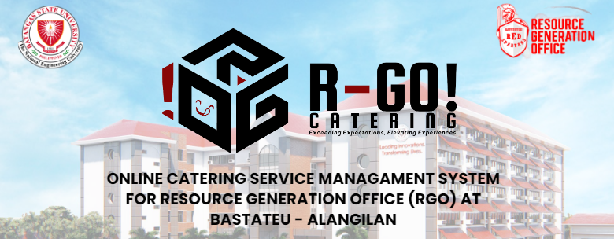
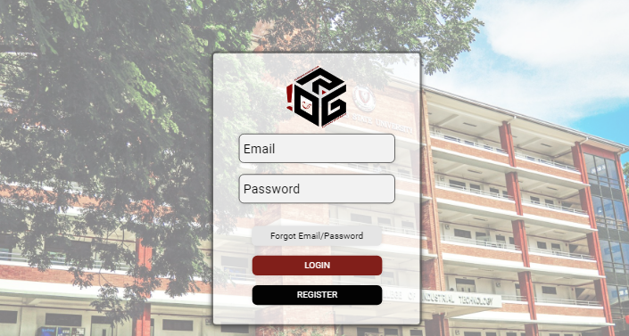
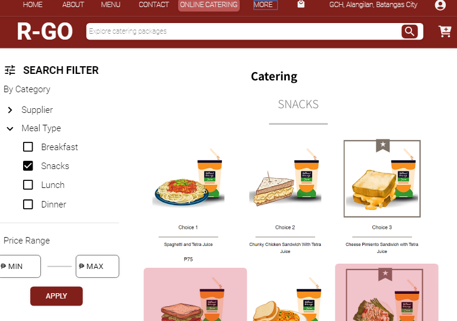

# Final Project

### ONLINE CATERING SERVICE MANAGEMENT SYSTEM FOR RESOURCE GENERATION OFFICE (RGO) AT BATSTATEU - ALANGILAN

## INTRODUCTION
The web-based platform for the RGO will comprise functionalities to handle catering orders and financial transactions, as well as a searchable database, trend analytics, and backup and recovery mechanisms. Implementing this user-friendly system will alleviate the burden of manual tasks and improve the overall experience for clients and users. This type of service plays a crucial role in supporting various events and activities on campus, including meetings, conferences, seminars, and other gatherings. 
## Project Screenshots
### Login Page Sample

### Food Menu (Customer)

# Created With 
## Ionic Framework
- Ionic is an open source UI toolkit for building performant, high-quality mobile apps using web technologies — HTML, CSS, and JavaScript — with integrations for popular frameworks like Angular, React, and Vue.
## Angular
- Angular is a platform and framework for building single-page client applications using HTML and TypeScript. Angular is written in TypeScript. It implements core and optional functionality as a set of TypeScript libraries that you import into your applications.
# About us
## Developers

- [Pangilinan, Nico Alfonso N.](https://github.com/Nicopangilinan)

- [Sarmiento, Trisha Fae S.](https://github.com/BIBII23)

- [Valenton, Gabriel P.](https://github.com/dubs910)
